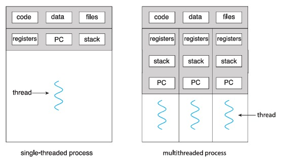

# **Firda Rahayu** 
# **NRP: 3124521002** 
# **KELAS: TI A**
------

## 1. Jelaskan dalam 2 paragraph disertai dengan gambar tentang konsep single thread dan multithread!



### Single Thread
Single-threading adalah konsep pemrograman di mana sebuah proses hanya memiliki satu alur eksekusi (thread) yang berjalan secara berurutan. Dalam sistem ini, setiap tugas harus diselesaikan sebelum tugas berikutnya dapat dimulai, sehingga dapat menyebabkan keterlambatan jika ada operasi yang membutuhkan waktu lama, seperti pemrosesan data besar atau komunikasi jaringan. Single-threading lebih sederhana dalam implementasi dan lebih mudah untuk dikelola karena tidak ada risiko kondisi balapan atau sinkronisasi antar thread. Namun, dalam aplikasi yang membutuhkan respons cepat atau pemrosesan paralel, pendekatan ini bisa menjadi kurang efisien.

### Multithread
Multithread memungkinkan suatu program memiliki beberapa jalur eksekusi yang dapat berjalan bersamaan. Dengan cara ini, berbagai bagian program dapat bekerja secara paralel, sehingga meningkatkan efisiensi dan kecepatan pemrosesan. Misalnya, dalam aplikasi peramban web, satu thread bisa menangani pemuatan halaman, sementara thread lain memproses input pengguna secara bersamaan. Teknik ini digunakan untuk mengoptimalkan kinerja sistem terutama dalam lingkungan dengan banyak tugas yang harus diselesaikan bersamaan

## 2. Kerjakan Programming Exercise a. Penerapan thread pada contoh SumTask.java b. penerapan Thread di Linux (thrd-posix.c) dan penerapan thread di Microsoft Windows (thrd-win32.c) . Beri penjelasan dalam bentuk esay. Gunakan Link https://github.com/ferryastika/osc10e/tree/master/ch4

### Penerapan Thread pada Java (`SumTask.java`)

Program `SumTask.java` merupakan implementasi **paralel menggunakan Fork/Join Framework** di Java. Konsep yang diangkat adalah memecah pekerjaan besar menjadi beberapa tugas kecil yang bisa dijalankan secara paralel oleh beberapa thread.

```java
public class SumTask extends RecursiveTask<Integer>

```

Kelas ini adalah turunan dari `RecursiveTask<Integer>`, yaitu bagian dari Fork/Join yang memungkinkan kita memecah tugas secara rekursif dan menjalankannya paralel.


```java
if (end - begin < THRESHOLD) {   
} else {
}

```

Kalau jumlah data yang diproses lebih kecil dari `THRESHOLD` (yaitu 1000), maka proses penjumlahan dilakukan langsung (disebut **conquer**). Tapi kalau lebih besar, array dibagi dua bagian dan masing-masing dibuat jadi subtask baru (**divide**). Subtask ini dijalankan paralel lewat `fork()`.

```java
leftTask.fork();
rightTask.fork();
return rightTask.join() + leftTask.join();

```

Setelah membagi array, dua subtask (`leftTask` dan `rightTask`) dijalankan paralel. Kemudian, program menunggu masing-masing selesai dengan `join()`, lalu hasilnya dijumlahkan.

```java
ForkJoinPool pool = new ForkJoinPool();
int sum = pool.invoke(task);

```

Di `main()`, program membuat array acak berukuran 10.000 elemen, lalu membuat objek `SumTask` dan menjalankannya dengan `ForkJoinPool`. Pool ini otomatis mengatur thread-thread yang dibutuhkan.


Dengan pendekatan Fork/Join, program ini mampu membagi proses penjumlahan menjadi sub-proses yang berjalan paralel, sehingga lebih efisien dibanding penjumlahan biasa, terutama di sistem multi-core. Program ini cocok jadi contoh penerapan threading modern di Java, yang tidak lagi harus membuat thread satu per satu, tapi cukup fokus pada pembagian tugas, dan sistem yang mengatur paralelismenya.


### Penerapan Thread di Linux (`thrd-posix.c`)

Program `thrd-posix.c` adalah contoh penerapan multithreading di Linux menggunakan **POSIX Thread** (pthreads). Dengan API ini, programmer bisa membuat dan mengatur thread secara langsung dalam bahasa C. Konsep dasar di program ini adalah membuat satu thread tambahan untuk menghitung jumlah angka dari 0 sampai angka tertentu.


```c
pthread_t tid;
pthread_create(&tid, NULL, runner, argv[1]);

```

Di sini, `pthread_create()` dipakai untuk membuat thread baru. Parameter `runner` adalah fungsi yang akan dijalankan oleh thread. Argumen `argv[1]` berisi batas akhir dari penjumlahan, yang diambil dari input saat program dijalankan.


```c
void *runner(void *param) {
    int i, upper = atoi(param);
    sum = 0;
    for (i = 1; i <= upper; i++)
        sum += i;

    pthread_exit(0);
}

```

Fungsi `runner` ini akan dijalankan oleh thread yang dibuat tadi. Ia mengonversi parameter ke integer (`upper`), lalu menjumlahkan angka dari 1 sampai `upper`. Hasilnya disimpan di variabel global `sum`.


```c
pthread_join(tid, NULL);

```

Setelah thread dibuat, thread utama tidak langsung dilanjutkan. Dia nunggu thread tambahan selesai dulu dengan `pthread_join()`. Ini penting supaya hasil perhitungan dari thread tambahan gak diakses sebelum waktunya.

Keseluruhannya, penerapan thread di `thrd-posix.c` cukup simpel tapi mencerminkan cara kerja dasar multithreading di Linux.  Ada beberapa keuntungan penggunaanya juga seperti Program bisa jadi lebih responsif, Proses-proses berat bisa dibagi ke thread sendiri dan Bisa disesuaikan untuk lebih banyak thread di realtime case.


### Penerapan Thread di Windows (`thrd-win32.c`)

Program `thrd-win32.c` merupakan contoh penggunaan **thread di sistem operasi Microsoft Windows**. Tidak seperti POSIX Thread di Linux, Windows punya API sendiri untuk manajemen thread, salah satunya lewat fungsi `CreateThread()`. Tujuan program ini sama seperti versi POSIX-nya, yaitu menghitung jumlah angka dari 0 sampai angka tertentu (yang dimasukkan lewat command line).

```c
DWORD ThreadId;
HANDLE ThreadHandle;
ThreadHandle = CreateThread(NULL, 0, Summation, argv[1], 0, &ThreadId);

```

Fungsi `CreateThread()` digunakan untuk membuat thread baru. Fungsi yang dijalankan adalah `Summation`, dan argumen yang dikirim adalah `argv[1]`, yaitu batas angka terakhir untuk dijumlahkan. Thread akan berjalan sendiri setelah dipanggil.

```c
DWORD WINAPI Summation(LPVOID Param) {
    int upper = atoi(Param);
    Sum = 0;
    for (int i = 1; i <= upper; i++)
        Sum += i;

    return 0;
}

```

Fungsi `Summation` dijalankan oleh thread yang dibuat. Di dalamnya, program mengonversi argumen ke integer, lalu menjumlahkan angka dari 1 sampai `upper`. Hasil disimpan di variabel global `Sum`.

```c
WaitForSingleObject(ThreadHandle, INFINITE);

```

Agar thread utama tidak mengeksekusi lebih dulu sebelum thread selesai, digunakan `WaitForSingleObject()` untuk menunggu sampai thread selesai bekerja. Tanpa ini, nilai `Sum` bisa diakses sebelum selesai dihitung.


Penerapan thread di Windows melalui `CreateThread()` cukup fleksibel, tapi sedikit lebih verbose dibanding pthread di Linux. Setiap thread diidentifikasi lewat `HANDLE`, dan fungsi yang dijalankan harus mengikuti format khusus (`DWORD WINAPI`).

## 3. Buat PPT tentang evolusi teknilogi processor Intel dengan menggunakan referensi : https://www.youtube.com/watch?v=PT787d9odKk

### Presentasi Evolusi Intel Slide ver.
[Klik di sini untuk melihat presentasi evolusi prosesor Intel saya dalam bentuk slide](https://hackmd.io/@509MbGdmRUmBVlnoEynIkw/Hky10DQyel)

## 4. Jawab pertanyaan practiceexercise pada chapter 4 ! Semua pekerjaan dilaporkan dalam bentuk tulisan di github anda masing-masing. 

### 4.1 Provide three programming examples in which multithreading provides better performance than a single-threaded solution.

#### => Web Server,  Web server multithreaded dapat menangani banyak permintaan klien secara paralel, sementara single-thread hanya bisa melayani satu permintaan dalam satu waktu. 
#### => Aplikasi GUI (Graphical User Interface),  Dengan thread terpisah untuk logika latar belakang (misalnya download file) dan untuk tampilan, aplikasi jadi lebih responsif. 
#### => Proses Komputasi Paralel (seperti sorting besar atau matrix multiplication), Tugas besar bisa dibagi ke beberapa thread untuk diproses paralel, mempercepat eksekusi dibanding satu thread.

### 4.2 Using Amdahl’s Law, calculate the speedup gain of an application that has a 60 percent parallel component for (a) two processing cores and (b) four processing cores.

$$
\text{Speedup} = \frac{1}{(1-P) + \frac{P}{N}}
$$

Dengan:
*   $P = 0.6$ (60% paralel)
*   $N =$ jumlah core

(a) $N = 2$:
$$
\text{Speedup} = \frac{1}{(1-0.6) + \frac{0.6}{2}} = \frac{1}{0.4 + 0.3} = \frac{1}{0.7} \approx 1.43
$$

(b) $N = 4$:
$$
\text{Speedup} = \frac{1}{(1-0.6) + \frac{0.6}{4}} = \frac{1}{0.4 + 0.15} = \frac{1}{0.55} \approx 1.82
$$

### 4.3 Does the multithreaded web server described in Section 4.1 exhibit task or data parallelism?
#### Menggunakan task parallelism, karena tiap thread menangani request yang berbeda dari klien. Tugasnya berbeda-beda, meskipun jenisnya serupa.

### 4.4  What are two differences between user-level threads and kernel-level threads? Under what circumstances is one type better than the other?
#### User-Level Thread itu dikelola di user space, jadi lebih cepat untuk pindah antar thread-nya tanpa perlu panggilan ke kernel. Tapi, kelemahannya, thread ini tidak bisa jalan paralel di sistem multicore karena kernel cuma mengenali satu thread aja. Sementara itu, Kernel-Level Thread dikelola langsung oleh sistem operasi di ruang kernel (kernel space). Karena itu, thread ini bisa jalan paralel di multicore karena kernel tahu semua thread yang ada. Walaupun switching antar thread-nya lebih lambat karena butuh konteks-switching di kernel, Kernel-Level Thread lebih cocok untuk sistem multicore dan saat blocking I/O sering terjadi. Secara keseluruhan, User-Level Thread lebih efisien di sistem single-core, sementara Kernel-Level Thread lebih diuntungkan di sistem multicore dan saat ada masalah dengan blocking I/O.

### 4.5 Describe the actions taken by a kernel to context-switch between kernel-level threads.
#### Proses ini melibatkan beberapa langkah penting dalam pengelolaan thread oleh sistem. Pertama, sistem akan menyimpan konteks seperti register, counter, stack pointer, dan lainnya dari thread yang sedang berjalan. Setelah itu, status thread yang sedang berjalan diperbarui dalam tabel thread/kernel untuk mencatat perubahan kondisi thread tersebut. Kemudian, scheduler akan memilih thread berikutnya yang akan dijalankan. Setelah thread baru dipilih, sistem akan memuat konteks dari thread tersebut, yang berisi data dan status yang diperlukan untuk melanjutkan eksekusinya. Akhirnya, eksekusi thread yang baru dipilih pun dimulai, dan sistem kembali menjalankan thread tersebut sesuai dengan konteks yang telah dimuat.

### 4.6 What resources are used when a thread is created? How do they differ from those used when a process is created?
#### Thread membutuhkan stack, register, program counter, dan thread ID sendiri, tapi berbagi memori, file descriptor, dan data lainnya dengan thread lain dalam satu proses. Sementara itu, proses membutuhkan sumber daya baru seperti memori, file, dan tabel proses. Karena itu, thread lebih ringan daripada proses, membuat pembuatan dan switching-nya lebih efisien.

### 4.7 Assume that an operating system maps user-level threads to the kernel using the many-to-many model and that the mapping is done through LWPs. Furthermore, the system allows developers to create real-time threads for use in real-time systems. Is it necessary to bind a real-time thread to an LWP? Explain.
#### Benar. Untuk thread real-time, waktu eksekusinya sangat penting. Dengan mengikat thread ke LWP (Lightweight Process), kita memastikan thread tersebut memiliki jalur langsung ke kernel, memungkinkan sistem untuk menjadwalkannya secara real-time. Tanpa pengikatan ini, thread real-time bisa tertunda oleh thread lain, karena kernel tidak mengenal thread tersebut sebagai prioritas tinggi.
