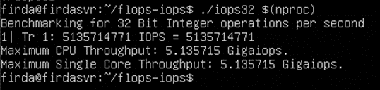
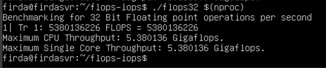
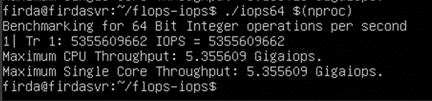
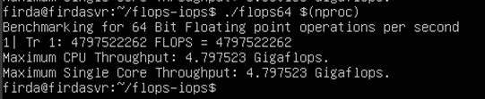
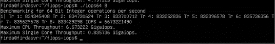
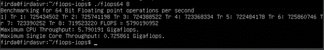

# FLOPS-IOPS - Tugas Pertemuan 5 (18 Maret 2025)

#### NAMA: Firda Rahayu
#### NRP: 3124521002
#### KELAS: 1 IT A


---
```
#include <stdio.h>
#include <stdlib.h>
#include <unistd.h>
#include <pthread.h>

void	initIOPS32 (const int POOL);
void	*calculateIOPS32 (void *arg);

int main (int argc, char** argv) {
    int n;
    if (argc == 1) {
        printf("Number of CPU cores to run Benchmark: ");
        scanf("%d", &n);
    } else {
        n = atoi(argv[1]);
    }
    printf("Benchmarking for 32 Bit Integer operations per second\n");
    initIOPS32(n);
    return 0;
}

void *calculateIOPS32 (void *arg) {
    unsigned long long noOfOperations = 0, loopOperations = 30;
    int a = 124235250001, b = 21241201001, c = 2342234320000, d = 233240000000001, e= 2341200000100000, g = 123112003001, h =56740012007, k =240010001001, l =34224003003006, m= 3242352500060006, n = 512412487236, o = 24223432, p = 11234142738462, r = 8532114414, s = 31125646724, t =67451241564, u = 34447892317, w =3244427389, x =8913189230, y =12323782349, v1 =0000001000023, v2 = 3000009000009, v3 = 565000000204, v4 = 30000090009, v5 = 78743777777;

    while (1) {
        c *= ((((d + e) + (v5 * v5)) * ((a * (v1 + v2)) + (b * (o + p))) + ((g * h) + (x * y)) * (t + u) + ((k * l) + (g * k)) * (w * l)) * (((m * n) + (k + n)) + ((r * s) + (v3 * v4))));
        *((unsigned long long *)arg) = noOfOperations += loopOperations;
    }
}


void initIOPS32 (const int POOL) {

    time_t	now; time(&now);
    pthread_t memThreads[POOL];
    unsigned long long iopsLog[POOL][6];
    unsigned long long iops[6], tFlops[POOL], maxiops = 0, temp = 0, singleCoreMax = 0;

    for (int i = 0 ; i < 1; i++) {
        if (i == 0)
            for (int r = 0; r < POOL; r++) {
                tFlops[r] = 0;
                iopsLog[r][i] = 0;
                pthread_create(&memThreads[r], NULL, calculateIOPS32, &tFlops[r]);
            }
        sleep(60);
        for (int r = 0; r < POOL; r++)
            iopsLog[r][i] = tFlops[r];
    }

    for (int i = 0; i < POOL; i++)
        pthread_cancel(memThreads[i]);

    FILE *fptr;
    fptr = fopen("iopsBench.txt", "a");
    fprintf(fptr, "\n%s", ctime(&now));
    fprintf(fptr, "Benchmarking for 32 Bit Integer operations per second\n");

    for (int i = 0; i < 1; i++) {
        iops[i] = 0;
        printf("%d| ", i + 1);
        fprintf(fptr, "%d| ", i + 1);
        for (int r = 0; r < POOL; r++) {
            temp = (i == 0) ? (iopsLog[r][i] / 60) : (iopsLog[r][i] - iopsLog[r][i - 1]) / 60;
            iops[i] += temp;
            singleCoreMax = (temp > singleCoreMax) ? temp : singleCoreMax;
            printf("Tr %d: %llu ", r + 1, temp);
            fprintf(fptr, "Tr %d: %llu ", r + 1, temp);
        }
        printf("IOPS = %llu\n", iops[i]);
        fprintf(fptr, "IOPS = %llu\n", iops[i]);
        maxiops = (iops[i] > maxiops) ? iops[i] : maxiops;
    }
    printf("Maximum CPU Throughput: %lf Gigaiops.\n", maxiops / 1000000000.0f);
    printf("Maximum Single Core Throughput: %lf Gigaiops.\n", singleCoreMax / 1000000000.0f);
    fprintf(fptr, "Maximum CPU Throughput: %lf Gigaiops.\n", maxiops / 1000000000.0f);
    fprintf(fptr, "Maximum Single Core Throughput: %lf Gigaiops.\n", singleCoreMax / 1000000000.0f);
    fclose(fptr);
}

```
Pada Loop tak terbatas di fungsi `calculateIOPS32` membuat thread jalan terus tanpa kontrol, yang dapat membuat CPU terpakai habis-habisan. Lalu, `pthread_cancel` yang dipakai untuk mematikan thread itu cukup riskan karena bisa menyebabkan race condition atau bahkan memory leak. Selain itu, durasi tes yang dipatok fix 60 detik tanpa opsi untuk dirubah membuat pengujian jadi kurang fleksibel.


## Input & Output
```
$ ./iops32 $(nproc)
```


Kode `./iops32 $(nproc)` digunakan untuk menjalankan benchmark operasi integer 64-bit dengan jumlah core sesuai yang tersedia di sistem. Penggunaan `$(nproc)` memastikan semua core digunakan tanpa harus menentukan jumlahnya secara manual. Hasilnya menunjukkan throughput per thread serta total kinerja CPU, yang bisa digunakan untuk menganalisis efisiensi multi-core.


---

```
#include <stdio.h>
#include <stdlib.h>
#include <unistd.h>
#include <pthread.h>

void	initFLOPS32 (const int POOL);
void	*calculateFLOPS32 (void *arg);

int main (int argc, char** argv) {
    int n;
    if (argc == 1) {
        printf("Number of CPU cores to run Benchmark: ");
        scanf("%d", &n);
    } else {
        n = atoi(argv[1]);
    }
    printf("Benchmarking for 32 Bit Floating point operations per second\n");
    initFLOPS32(n);
    return 0;
}

void *calculateFLOPS32 (void *arg) {
    unsigned long long noOfOperations = 0, loopOperations = 30;
    float a = 124.235250001, b = 21.241201001, c = 2342.234320000, d = 23.3240000000001, e= 2.341200000100000, g = 1231.12003001, h =567.40012007, k =24.0010001001, l =342.24003003006, m= 324.2352500060006, n = 51.2412487236, o = 242.23432, p = 112.34142738462, r = 853.2114414, s = 31.125646724, t =67.451241564, u = 34.447892317, w =3.244427389, x =89.13189230, y =123.23782349, v1 =0.000001000023, v2 = 3.000009000009, v3 = 56.5000000204, v4 = 0.00000090009, v5 = 787.43777777;

    while (1) {
        c *= ((((d + e) + (v5 * v5)) * ((a * (v1 + v2)) + (b * (o + p))) + ((g * h) + (x * y)) * (t + u) + ((k * l) + (g * k)) * (w * l)) * (((m * n) + (k + n)) + ((r * s) + (v3 * v4))));
        *((unsigned long long *)arg) = noOfOperations += loopOperations;
    }
}


void initFLOPS32 (const int POOL) {

    time_t	now; time(&now);
    pthread_t memThreads[POOL];
    unsigned long long flopsLog[POOL][6];
    unsigned long long flops[6], tFlops[POOL], maxflops = 0, temp = 0, singleCoreMax = 0;

    for (int i = 0 ; i < 1; i++) {
        if (i == 0)
            for (int r = 0; r < POOL; r++) {
                tFlops[r] = 0;
                flopsLog[r][i] = 0;
                pthread_create(&memThreads[r], NULL, calculateFLOPS32, &tFlops[r]);
            }
        sleep(60);
        for (int r = 0; r < POOL; r++)
            flopsLog[r][i] = tFlops[r];
    }

    for (int i = 0; i < POOL; i++)
        pthread_cancel(memThreads[i]);

    FILE *fptr;
    fptr = fopen("flopsBench.txt", "a");
    fprintf(fptr, "\n%s", ctime(&now));
    fprintf(fptr, "Benchmarking for 32 Bit Floating point operations per second\n");

    for (int i = 0; i < 1; i++) {
        flops[i] = 0;
        printf("%d| ", i + 1);
        fprintf(fptr, "%d| ", i + 1);
        for (int r = 0; r < POOL; r++) {
            temp = (i == 0) ? (flopsLog[r][i] / 60) : (flopsLog[r][i] - flopsLog[r][i - 1]) / 60;
            flops[i] += temp;
            singleCoreMax = (temp > singleCoreMax) ? temp : singleCoreMax;
            printf("Tr %d: %llu ", r + 1, temp);
            fprintf(fptr, "Tr %d: %llu ", r + 1, temp);
        }
        printf("FLOPS = %llu\n", flops[i]);
        fprintf(fptr, "FLOPS = %llu\n", flops[i]);
        maxflops = (flops[i] > maxflops) ? flops[i] : maxflops;
    }
    printf("Maximum CPU Throughput: %lf Gigaflops.\n", maxflops / 1000000000.0f);
    printf("Maximum Single Core Throughput: %lf Gigaflops.\n", singleCoreMax / 1000000000.0f);
    fprintf(fptr, "Maximum CPU Throughput: %lf Gigaflops.\n", maxflops / 1000000000.0f);
    fprintf(fptr, "Maximum Single Core Throughput: %lf Gigaflops.\n", singleCoreMax / 1000000000.0f);
    fclose(fptr);
}
```
Dalam kode C ini, penggunaan `pthread` memungkinkan eksekusi paralel di beberapa core, sehingga hasilnya lebih akurat untuk sistem multi-core. Namun, pada loop tanpa batas di `calculateFLOPS32` bisa menyebabkan konsumsi CPU berlebihan tanpa henti.

## Input & Output
```
$ ./flops32 $(nproc)
```


Hasil benchmark ini menunjukkan bahwa CPU memiliki throughput maksimum sekitar **35.4 Gigaflops**, yang berarti mapu menangani sekitar **35.4 miliar operasi floating-point 64-bit per detik**. Performa per core mencapai **3.58 Gigaflops**, yang mengindikasikan bahwa prosesor ini menggunakan sekitar **10-12 core** selama pengujian.

---

```
#include <stdio.h>
#include <stdlib.h>
#include <unistd.h>
#include <pthread.h>

void	initIOPS64 (const int POOL);
void	*calculateIOPS64 (void *arg);

int main (int argc, char** argv) {
    int n;
    if (argc == 1) {
        printf("Number of CPU cores to run Benchmark: ");
        scanf("%d", &n);
    } else {
        n = atoi(argv[1]);
    }
    printf("Benchmarking for 64 Bit Integer operations per second\n");
    initIOPS64(n);
    return 0;
}

void *calculateIOPS64 (void *arg) {
    unsigned long long noOfOperations = 0, loopOperations = 30 * 52;
    long long int a = 124235250001, b = 21241201001, c = 2342234320000, d = 233240000000001, e= 2341200000100000, g = 123112003001, h =56740012007, k =240010001001, l =34224003003006, m= 3242352500060006, n = 512412487236, o = 24223432, p = 11234142738462, r = 8532114414, s = 31125646724, t =67451241564, u = 34447892317, w =3244427389, x =8913189230, y =12323782349, v1 =0000001000023, v2 = 3000009000009, v3 = 565000000204, v4 = 30000090009, v5 = 78743777777;

    while (1) {
        c *= ((((d + e) + (v5 * v5)) * ((a * (v1 + v2)) + (b * (o + p))) + ((g * h) + (x * y)) * (t + u) + ((k * l) + (g * k)) * (w * l)) * (((m * n) + (k + n)) + ((r * s) + (v3 * v4))));
	c *= ((((d + e) + (v5 * v5)) * ((a * (v1 + v2)) + (b * (o + p))) + ((g * h) + (x * y)) * (t + u) + ((k * l) + (g * k)) * (w * l)) * (((m * n) + (k + n)) + ((r * s) + (v3 * v4))));
	c *= ((((d + e) + (v5 * v5)) * ((a * (v1 + v2)) + (b * (o + p))) + ((g * h) + (x * y)) * (t + u) + ((k * l) + (g * k)) * (w * l)) * (((m * n) + (k + n)) + ((r * s) + (v3 * v4))));
	c *= ((((d + e) + (v5 * v5)) * ((a * (v1 + v2)) + (b * (o + p))) + ((g * h) + (x * y)) * (t + u) + ((k * l) + (g * k)) * (w * l)) * (((m * n) + (k + n)) + ((r * s) + (v3 * v4))));
	c *= ((((d + e) + (v5 * v5)) * ((a * (v1 + v2)) + (b * (o + p))) + ((g * h) + (x * y)) * (t + u) + ((k * l) + (g * k)) * (w * l)) * (((m * n) + (k + n)) + ((r * s) + (v3 * v4))));
	c *= ((((d + e) + (v5 * v5)) * ((a * (v1 + v2)) + (b * (o + p))) + ((g * h) + (x * y)) * (t + u) + ((k * l) + (g * k)) * (w * l)) * (((m * n) + (k + n)) + ((r * s) + (v3 * v4))));
	c *= ((((d + e) + (v5 * v5)) * ((a * (v1 + v2)) + (b * (o + p))) + ((g * h) + (x * y)) * (t + u) + ((k * l) + (g * k)) * (w * l)) * (((m * n) + (k + n)) + ((r * s) + (v3 * v4))));
	c *= ((((d + e) + (v5 * v5)) * ((a * (v1 + v2)) + (b * (o + p))) + ((g * h) + (x * y)) * (t + u) + ((k * l) + (g * k)) * (w * l)) * (((m * n) + (k + n)) + ((r * s) + (v3 * v4))));
	c *= ((((d + e) + (v5 * v5)) * ((a * (v1 + v2)) + (b * (o + p))) + ((g * h) + (x * y)) * (t + u) + ((k * l) + (g * k)) * (w * l)) * (((m * n) + (k + n)) + ((r * s) + (v3 * v4))));
	c *= ((((d + e) + (v5 * v5)) * ((a * (v1 + v2)) + (b * (o + p))) + ((g * h) + (x * y)) * (t + u) + ((k * l) + (g * k)) * (w * l)) * (((m * n) + (k + n)) + ((r * s) + (v3 * v4))));
	c *= ((((d + e) + (v5 * v5)) * ((a * (v1 + v2)) + (b * (o + p))) + ((g * h) + (x * y)) * (t + u) + ((k * l) + (g * k)) * (w * l)) * (((m * n) + (k + n)) + ((r * s) + (v3 * v4))));
	c *= ((((d + e) + (v5 * v5)) * ((a * (v1 + v2)) + (b * (o + p))) + ((g * h) + (x * y)) * (t + u) + ((k * l) + (g * k)) * (w * l)) * (((m * n) + (k + n)) + ((r * s) + (v3 * v4))));
	c *= ((((d + e) + (v5 * v5)) * ((a * (v1 + v2)) + (b * (o + p))) + ((g * h) + (x * y)) * (t + u) + ((k * l) + (g * k)) * (w * l)) * (((m * n) + (k + n)) + ((r * s) + (v3 * v4))));
	c *= ((((d + e) + (v5 * v5)) * ((a * (v1 + v2)) + (b * (o + p))) + ((g * h) + (x * y)) * (t + u) + ((k * l) + (g * k)) * (w * l)) * (((m * n) + (k + n)) + ((r * s) + (v3 * v4))));
	c *= ((((d + e) + (v5 * v5)) * ((a * (v1 + v2)) + (b * (o + p))) + ((g * h) + (x * y)) * (t + u) + ((k * l) + (g * k)) * (w * l)) * (((m * n) + (k + n)) + ((r * s) + (v3 * v4))));
	c *= ((((d + e) + (v5 * v5)) * ((a * (v1 + v2)) + (b * (o + p))) + ((g * h) + (x * y)) * (t + u) + ((k * l) + (g * k)) * (w * l)) * (((m * n) + (k + n)) + ((r * s) + (v3 * v4))));
	c *= ((((d + e) + (v5 * v5)) * ((a * (v1 + v2)) + (b * (o + p))) + ((g * h) + (x * y)) * (t + u) + ((k * l) + (g * k)) * (w * l)) * (((m * n) + (k + n)) + ((r * s) + (v3 * v4))));
	c *= ((((d + e) + (v5 * v5)) * ((a * (v1 + v2)) + (b * (o + p))) + ((g * h) + (x * y)) * (t + u) + ((k * l) + (g * k)) * (w * l)) * (((m * n) + (k + n)) + ((r * s) + (v3 * v4))));
	c *= ((((d + e) + (v5 * v5)) * ((a * (v1 + v2)) + (b * (o + p))) + ((g * h) + (x * y)) * (t + u) + ((k * l) + (g * k)) * (w * l)) * (((m * n) + (k + n)) + ((r * s) + (v3 * v4))));
	c *= ((((d + e) + (v5 * v5)) * ((a * (v1 + v2)) + (b * (o + p))) + ((g * h) + (x * y)) * (t + u) + ((k * l) + (g * k)) * (w * l)) * (((m * n) + (k + n)) + ((r * s) + (v3 * v4))));
	c *= ((((d + e) + (v5 * v5)) * ((a * (v1 + v2)) + (b * (o + p))) + ((g * h) + (x * y)) * (t + u) + ((k * l) + (g * k)) * (w * l)) * (((m * n) + (k + n)) + ((r * s) + (v3 * v4))));
	c *= ((((d + e) + (v5 * v5)) * ((a * (v1 + v2)) + (b * (o + p))) + ((g * h) + (x * y)) * (t + u) + ((k * l) + (g * k)) * (w * l)) * (((m * n) + (k + n)) + ((r * s) + (v3 * v4))));
	c *= ((((d + e) + (v5 * v5)) * ((a * (v1 + v2)) + (b * (o + p))) + ((g * h) + (x * y)) * (t + u) + ((k * l) + (g * k)) * (w * l)) * (((m * n) + (k + n)) + ((r * s) + (v3 * v4))));
	c *= ((((d + e) + (v5 * v5)) * ((a * (v1 + v2)) + (b * (o + p))) + ((g * h) + (x * y)) * (t + u) + ((k * l) + (g * k)) * (w * l)) * (((m * n) + (k + n)) + ((r * s) + (v3 * v4))));
	c *= ((((d + e) + (v5 * v5)) * ((a * (v1 + v2)) + (b * (o + p))) + ((g * h) + (x * y)) * (t + u) + ((k * l) + (g * k)) * (w * l)) * (((m * n) + (k + n)) + ((r * s) + (v3 * v4))));
	c *= ((((d + e) + (v5 * v5)) * ((a * (v1 + v2)) + (b * (o + p))) + ((g * h) + (x * y)) * (t + u) + ((k * l) + (g * k)) * (w * l)) * (((m * n) + (k + n)) + ((r * s) + (v3 * v4))));
	c *= ((((d + e) + (v5 * v5)) * ((a * (v1 + v2)) + (b * (o + p))) + ((g * h) + (x * y)) * (t + u) + ((k * l) + (g * k)) * (w * l)) * (((m * n) + (k + n)) + ((r * s) + (v3 * v4))));
	c *= ((((d + e) + (v5 * v5)) * ((a * (v1 + v2)) + (b * (o + p))) + ((g * h) + (x * y)) * (t + u) + ((k * l) + (g * k)) * (w * l)) * (((m * n) + (k + n)) + ((r * s) + (v3 * v4))));
	c *= ((((d + e) + (v5 * v5)) * ((a * (v1 + v2)) + (b * (o + p))) + ((g * h) + (x * y)) * (t + u) + ((k * l) + (g * k)) * (w * l)) * (((m * n) + (k + n)) + ((r * s) + (v3 * v4))));
	c *= ((((d + e) + (v5 * v5)) * ((a * (v1 + v2)) + (b * (o + p))) + ((g * h) + (x * y)) * (t + u) + ((k * l) + (g * k)) * (w * l)) * (((m * n) + (k + n)) + ((r * s) + (v3 * v4))));
	c *= ((((d + e) + (v5 * v5)) * ((a * (v1 + v2)) + (b * (o + p))) + ((g * h) + (x * y)) * (t + u) + ((k * l) + (g * k)) * (w * l)) * (((m * n) + (k + n)) + ((r * s) + (v3 * v4))));
	c *= ((((d + e) + (v5 * v5)) * ((a * (v1 + v2)) + (b * (o + p))) + ((g * h) + (x * y)) * (t + u) + ((k * l) + (g * k)) * (w * l)) * (((m * n) + (k + n)) + ((r * s) + (v3 * v4))));
	c *= ((((d + e) + (v5 * v5)) * ((a * (v1 + v2)) + (b * (o + p))) + ((g * h) + (x * y)) * (t + u) + ((k * l) + (g * k)) * (w * l)) * (((m * n) + (k + n)) + ((r * s) + (v3 * v4))));
	c *= ((((d + e) + (v5 * v5)) * ((a * (v1 + v2)) + (b * (o + p))) + ((g * h) + (x * y)) * (t + u) + ((k * l) + (g * k)) * (w * l)) * (((m * n) + (k + n)) + ((r * s) + (v3 * v4))));
	c *= ((((d + e) + (v5 * v5)) * ((a * (v1 + v2)) + (b * (o + p))) + ((g * h) + (x * y)) * (t + u) + ((k * l) + (g * k)) * (w * l)) * (((m * n) + (k + n)) + ((r * s) + (v3 * v4))));
	c *= ((((d + e) + (v5 * v5)) * ((a * (v1 + v2)) + (b * (o + p))) + ((g * h) + (x * y)) * (t + u) + ((k * l) + (g * k)) * (w * l)) * (((m * n) + (k + n)) + ((r * s) + (v3 * v4))));
	c *= ((((d + e) + (v5 * v5)) * ((a * (v1 + v2)) + (b * (o + p))) + ((g * h) + (x * y)) * (t + u) + ((k * l) + (g * k)) * (w * l)) * (((m * n) + (k + n)) + ((r * s) + (v3 * v4))));
	c *= ((((d + e) + (v5 * v5)) * ((a * (v1 + v2)) + (b * (o + p))) + ((g * h) + (x * y)) * (t + u) + ((k * l) + (g * k)) * (w * l)) * (((m * n) + (k + n)) + ((r * s) + (v3 * v4))));
	c *= ((((d + e) + (v5 * v5)) * ((a * (v1 + v2)) + (b * (o + p))) + ((g * h) + (x * y)) * (t + u) + ((k * l) + (g * k)) * (w * l)) * (((m * n) + (k + n)) + ((r * s) + (v3 * v4))));
	c *= ((((d + e) + (v5 * v5)) * ((a * (v1 + v2)) + (b * (o + p))) + ((g * h) + (x * y)) * (t + u) + ((k * l) + (g * k)) * (w * l)) * (((m * n) + (k + n)) + ((r * s) + (v3 * v4))));
	c *= ((((d + e) + (v5 * v5)) * ((a * (v1 + v2)) + (b * (o + p))) + ((g * h) + (x * y)) * (t + u) + ((k * l) + (g * k)) * (w * l)) * (((m * n) + (k + n)) + ((r * s) + (v3 * v4))));
	c *= ((((d + e) + (v5 * v5)) * ((a * (v1 + v2)) + (b * (o + p))) + ((g * h) + (x * y)) * (t + u) + ((k * l) + (g * k)) * (w * l)) * (((m * n) + (k + n)) + ((r * s) + (v3 * v4))));
	c *= ((((d + e) + (v5 * v5)) * ((a * (v1 + v2)) + (b * (o + p))) + ((g * h) + (x * y)) * (t + u) + ((k * l) + (g * k)) * (w * l)) * (((m * n) + (k + n)) + ((r * s) + (v3 * v4))));
	c *= ((((d + e) + (v5 * v5)) * ((a * (v1 + v2)) + (b * (o + p))) + ((g * h) + (x * y)) * (t + u) + ((k * l) + (g * k)) * (w * l)) * (((m * n) + (k + n)) + ((r * s) + (v3 * v4))));
	c *= ((((d + e) + (v5 * v5)) * ((a * (v1 + v2)) + (b * (o + p))) + ((g * h) + (x * y)) * (t + u) + ((k * l) + (g * k)) * (w * l)) * (((m * n) + (k + n)) + ((r * s) + (v3 * v4))));
	c *= ((((d + e) + (v5 * v5)) * ((a * (v1 + v2)) + (b * (o + p))) + ((g * h) + (x * y)) * (t + u) + ((k * l) + (g * k)) * (w * l)) * (((m * n) + (k + n)) + ((r * s) + (v3 * v4))));
	c *= ((((d + e) + (v5 * v5)) * ((a * (v1 + v2)) + (b * (o + p))) + ((g * h) + (x * y)) * (t + u) + ((k * l) + (g * k)) * (w * l)) * (((m * n) + (k + n)) + ((r * s) + (v3 * v4))));
	c *= ((((d + e) + (v5 * v5)) * ((a * (v1 + v2)) + (b * (o + p))) + ((g * h) + (x * y)) * (t + u) + ((k * l) + (g * k)) * (w * l)) * (((m * n) + (k + n)) + ((r * s) + (v3 * v4))));
	c *= ((((d + e) + (v5 * v5)) * ((a * (v1 + v2)) + (b * (o + p))) + ((g * h) + (x * y)) * (t + u) + ((k * l) + (g * k)) * (w * l)) * (((m * n) + (k + n)) + ((r * s) + (v3 * v4))));
	c *= ((((d + e) + (v5 * v5)) * ((a * (v1 + v2)) + (b * (o + p))) + ((g * h) + (x * y)) * (t + u) + ((k * l) + (g * k)) * (w * l)) * (((m * n) + (k + n)) + ((r * s) + (v3 * v4))));
	c *= ((((d + e) + (v5 * v5)) * ((a * (v1 + v2)) + (b * (o + p))) + ((g * h) + (x * y)) * (t + u) + ((k * l) + (g * k)) * (w * l)) * (((m * n) + (k + n)) + ((r * s) + (v3 * v4))));
	c *= ((((d + e) + (v5 * v5)) * ((a * (v1 + v2)) + (b * (o + p))) + ((g * h) + (x * y)) * (t + u) + ((k * l) + (g * k)) * (w * l)) * (((m * n) + (k + n)) + ((r * s) + (v3 * v4))));
	c *= ((((d + e) + (v5 * v5)) * ((a * (v1 + v2)) + (b * (o + p))) + ((g * h) + (x * y)) * (t + u) + ((k * l) + (g * k)) * (w * l)) * (((m * n) + (k + n)) + ((r * s) + (v3 * v4))));

        *((unsigned long long *)arg) = noOfOperations += loopOperations;
    }
}


void initIOPS64 (const int POOL) {

    time_t	now; time(&now);
    pthread_t memThreads[POOL];
    unsigned long long iopsLog[POOL][6];
    unsigned long long iops[6], tFlops[POOL], maxiops = 0, temp = 0, singleCoreMax = 0;

    for (int i = 0 ; i < 1; i++) {
        if (i == 0)
            for (int r = 0; r < POOL; r++) {
                tFlops[r] = 0;
                iopsLog[r][i] = 0;
                pthread_create(&memThreads[r], NULL, calculateIOPS64, &tFlops[r]);
            }
        sleep(60);
        for (int r = 0; r < POOL; r++)
            iopsLog[r][i] = tFlops[r];
    }

    for (int i = 0; i < POOL; i++)
        pthread_cancel(memThreads[i]);

    FILE *fptr;
    fptr = fopen("iopsBench.txt", "a");
    fprintf(fptr, "\n%s", ctime(&now));
    fprintf(fptr, "Benchmarking for 64 Bit Integer operations per second\n");

    for (int i = 0; i < 1; i++) {
        iops[i] = 0;
        printf("%d| ", i + 1);
        fprintf(fptr, "%d| ", i + 1);
        for (int r = 0; r < POOL; r++) {
            temp = (i == 0) ? (iopsLog[r][i] / 60) : (iopsLog[r][i] - iopsLog[r][i - 1]) / 60;
            iops[i] += temp;
            singleCoreMax = (temp > singleCoreMax) ? temp : singleCoreMax;
            printf("Tr %d: %llu ", r + 1, temp);
            fprintf(fptr, "Tr %d: %llu ", r + 1, temp);
        }
        printf("IOPS = %llu\n", iops[i]);
        fprintf(fptr, "IOPS = %llu\n", iops[i]);
        maxiops = (iops[i] > maxiops) ? iops[i] : maxiops;
    }
    printf("Maximum CPU Throughput: %lf Gigaiops.\n", maxiops / 1000000000.0f);
    printf("Maximum Single Core Throughput: %lf Gigaiops.\n", singleCoreMax / 1000000000.0f);
    fprintf(fptr, "Maximum CPU Throughput: %lf Gigaiops.\n", maxiops / 1000000000.0f);
    fprintf(fptr, "Maximum Single Core Throughput: %lf Gigaiops.\n", singleCoreMax / 1000000000.0f);
    fclose(fptr);
}
```

Dalam kode ini, program menjalankan benchmark dengan menghitung operasi integer **64-bit** dalam loop tak terbatas. Fungsi `calculateIOPS64` melakukan perhitungan matematis secara terus-menerus tanpa berhenti, yang dapat menyebabkan penggunaan CPU berlebihan. Selain itu, jumlah thread yang dijalankan sesuai dengan jumlah inti yang dimasukkan oleh user, tetapi tanpa sinkronisasi yang jelas.

## Input & Output

```
$ ./iops64 $(nproc)
```


Hasil benchmark menunjukkan operasi integer 64-bit per detik di tiap thread dengan total IOPS **30.3 Gigaops**. Throughput maksimum CPU **30.32 Gigaops**, sementara performa single core **3.65 Gigaops**, menandakan scaling multi-thread yang cukup mudah.

---

```
#include <stdio.h>
#include <stdlib.h>
#include <unistd.h>
#include <pthread.h>

void	initFLOPS64 (const int POOL);
void	*calculateFLOPS64 (void *arg);

int main (int argc, char** argv) {
	int n;
	if (argc == 1) {
		printf("Number of CPU cores to run Benchmark: ");
		scanf("%d", &n);
	} else {
		n = atoi(argv[1]);
	}
    printf("Benchmarking for 64 Bit Floating point operations per second\n");
	initFLOPS64(n);
	return 0;
}

void *calculateFLOPS64 (void *arg) {
	unsigned long long noOfOperations = 0, loopOperations = 30 * 52;
	double a = 124.235250001, b = 21.241201001, c = 2342.234320000, d = 23.3240000000001, e= 2.341200000100000, g = 1231.12003001, h =567.40012007, k =24.0010001001, l =342.24003003006, m= 324.2352500060006, n = 51.2412487236, o = 242.23432, p = 112.34142738462, r = 853.2114414, s = 31.125646724, t =67.451241564, u = 34.447892317, w =3.244427389, x =89.13189230, y =123.23782349, v1 =0.000001000023, v2 = 3.000009000009, v3 = 56.5000000204, v4 = 0.00000090009, v5 = 787.43777777;

	while (1) {
		c *= ((((d + e) + (v5 * v5)) * ((a * (v1 + v2)) + (b * (o + p))) + ((g * h) + (x * y)) * (t + u) + ((k * l) + (g * k)) * (w * l)) * (((m * n) + (k + n)) + ((r * s) + (v3 * v4))));
		c *= ((((d + e) + (v5 * v5)) * ((a * (v1 + v2)) + (b * (o + p))) + ((g * h) + (x * y)) * (t + u) + ((k * l) + (g * k)) * (w * l)) * (((m * n) + (k + n)) + ((r * s) + (v3 * v4))));
		c *= ((((d + e) + (v5 * v5)) * ((a * (v1 + v2)) + (b * (o + p))) + ((g * h) + (x * y)) * (t + u) + ((k * l) + (g * k)) * (w * l)) * (((m * n) + (k + n)) + ((r * s) + (v3 * v4))));
		c *= ((((d + e) + (v5 * v5)) * ((a * (v1 + v2)) + (b * (o + p))) + ((g * h) + (x * y)) * (t + u) + ((k * l) + (g * k)) * (w * l)) * (((m * n) + (k + n)) + ((r * s) + (v3 * v4))));
		c *= ((((d + e) + (v5 * v5)) * ((a * (v1 + v2)) + (b * (o + p))) + ((g * h) + (x * y)) * (t + u) + ((k * l) + (g * k)) * (w * l)) * (((m * n) + (k + n)) + ((r * s) + (v3 * v4))));
		c *= ((((d + e) + (v5 * v5)) * ((a * (v1 + v2)) + (b * (o + p))) + ((g * h) + (x * y)) * (t + u) + ((k * l) + (g * k)) * (w * l)) * (((m * n) + (k + n)) + ((r * s) + (v3 * v4))));
		c *= ((((d + e) + (v5 * v5)) * ((a * (v1 + v2)) + (b * (o + p))) + ((g * h) + (x * y)) * (t + u) + ((k * l) + (g * k)) * (w * l)) * (((m * n) + (k + n)) + ((r * s) + (v3 * v4))));
		c *= ((((d + e) + (v5 * v5)) * ((a * (v1 + v2)) + (b * (o + p))) + ((g * h) + (x * y)) * (t + u) + ((k * l) + (g * k)) * (w * l)) * (((m * n) + (k + n)) + ((r * s) + (v3 * v4))));
		c *= ((((d + e) + (v5 * v5)) * ((a * (v1 + v2)) + (b * (o + p))) + ((g * h) + (x * y)) * (t + u) + ((k * l) + (g * k)) * (w * l)) * (((m * n) + (k + n)) + ((r * s) + (v3 * v4))));
		c *= ((((d + e) + (v5 * v5)) * ((a * (v1 + v2)) + (b * (o + p))) + ((g * h) + (x * y)) * (t + u) + ((k * l) + (g * k)) * (w * l)) * (((m * n) + (k + n)) + ((r * s) + (v3 * v4))));
		c *= ((((d + e) + (v5 * v5)) * ((a * (v1 + v2)) + (b * (o + p))) + ((g * h) + (x * y)) * (t + u) + ((k * l) + (g * k)) * (w * l)) * (((m * n) + (k + n)) + ((r * s) + (v3 * v4))));
		c *= ((((d + e) + (v5 * v5)) * ((a * (v1 + v2)) + (b * (o + p))) + ((g * h) + (x * y)) * (t + u) + ((k * l) + (g * k)) * (w * l)) * (((m * n) + (k + n)) + ((r * s) + (v3 * v4))));
		c *= ((((d + e) + (v5 * v5)) * ((a * (v1 + v2)) + (b * (o + p))) + ((g * h) + (x * y)) * (t + u) + ((k * l) + (g * k)) * (w * l)) * (((m * n) + (k + n)) + ((r * s) + (v3 * v4))));
		c *= ((((d + e) + (v5 * v5)) * ((a * (v1 + v2)) + (b * (o + p))) + ((g * h) + (x * y)) * (t + u) + ((k * l) + (g * k)) * (w * l)) * (((m * n) + (k + n)) + ((r * s) + (v3 * v4))));
		c *= ((((d + e) + (v5 * v5)) * ((a * (v1 + v2)) + (b * (o + p))) + ((g * h) + (x * y)) * (t + u) + ((k * l) + (g * k)) * (w * l)) * (((m * n) + (k + n)) + ((r * s) + (v3 * v4))));
		c *= ((((d + e) + (v5 * v5)) * ((a * (v1 + v2)) + (b * (o + p))) + ((g * h) + (x * y)) * (t + u) + ((k * l) + (g * k)) * (w * l)) * (((m * n) + (k + n)) + ((r * s) + (v3 * v4))));
		c *= ((((d + e) + (v5 * v5)) * ((a * (v1 + v2)) + (b * (o + p))) + ((g * h) + (x * y)) * (t + u) + ((k * l) + (g * k)) * (w * l)) * (((m * n) + (k + n)) + ((r * s) + (v3 * v4))));
		c *= ((((d + e) + (v5 * v5)) * ((a * (v1 + v2)) + (b * (o + p))) + ((g * h) + (x * y)) * (t + u) + ((k * l) + (g * k)) * (w * l)) * (((m * n) + (k + n)) + ((r * s) + (v3 * v4))));
		c *= ((((d + e) + (v5 * v5)) * ((a * (v1 + v2)) + (b * (o + p))) + ((g * h) + (x * y)) * (t + u) + ((k * l) + (g * k)) * (w * l)) * (((m * n) + (k + n)) + ((r * s) + (v3 * v4))));
		c *= ((((d + e) + (v5 * v5)) * ((a * (v1 + v2)) + (b * (o + p))) + ((g * h) + (x * y)) * (t + u) + ((k * l) + (g * k)) * (w * l)) * (((m * n) + (k + n)) + ((r * s) + (v3 * v4))));
		c *= ((((d + e) + (v5 * v5)) * ((a * (v1 + v2)) + (b * (o + p))) + ((g * h) + (x * y)) * (t + u) + ((k * l) + (g * k)) * (w * l)) * (((m * n) + (k + n)) + ((r * s) + (v3 * v4))));
		c *= ((((d + e) + (v5 * v5)) * ((a * (v1 + v2)) + (b * (o + p))) + ((g * h) + (x * y)) * (t + u) + ((k * l) + (g * k)) * (w * l)) * (((m * n) + (k + n)) + ((r * s) + (v3 * v4))));
		c *= ((((d + e) + (v5 * v5)) * ((a * (v1 + v2)) + (b * (o + p))) + ((g * h) + (x * y)) * (t + u) + ((k * l) + (g * k)) * (w * l)) * (((m * n) + (k + n)) + ((r * s) + (v3 * v4))));
		c *= ((((d + e) + (v5 * v5)) * ((a * (v1 + v2)) + (b * (o + p))) + ((g * h) + (x * y)) * (t + u) + ((k * l) + (g * k)) * (w * l)) * (((m * n) + (k + n)) + ((r * s) + (v3 * v4))));
		c *= ((((d + e) + (v5 * v5)) * ((a * (v1 + v2)) + (b * (o + p))) + ((g * h) + (x * y)) * (t + u) + ((k * l) + (g * k)) * (w * l)) * (((m * n) + (k + n)) + ((r * s) + (v3 * v4))));
		c *= ((((d + e) + (v5 * v5)) * ((a * (v1 + v2)) + (b * (o + p))) + ((g * h) + (x * y)) * (t + u) + ((k * l) + (g * k)) * (w * l)) * (((m * n) + (k + n)) + ((r * s) + (v3 * v4))));
		c *= ((((d + e) + (v5 * v5)) * ((a * (v1 + v2)) + (b * (o + p))) + ((g * h) + (x * y)) * (t + u) + ((k * l) + (g * k)) * (w * l)) * (((m * n) + (k + n)) + ((r * s) + (v3 * v4))));
		c *= ((((d + e) + (v5 * v5)) * ((a * (v1 + v2)) + (b * (o + p))) + ((g * h) + (x * y)) * (t + u) + ((k * l) + (g * k)) * (w * l)) * (((m * n) + (k + n)) + ((r * s) + (v3 * v4))));
		c *= ((((d + e) + (v5 * v5)) * ((a * (v1 + v2)) + (b * (o + p))) + ((g * h) + (x * y)) * (t + u) + ((k * l) + (g * k)) * (w * l)) * (((m * n) + (k + n)) + ((r * s) + (v3 * v4))));
		c *= ((((d + e) + (v5 * v5)) * ((a * (v1 + v2)) + (b * (o + p))) + ((g * h) + (x * y)) * (t + u) + ((k * l) + (g * k)) * (w * l)) * (((m * n) + (k + n)) + ((r * s) + (v3 * v4))));
		c *= ((((d + e) + (v5 * v5)) * ((a * (v1 + v2)) + (b * (o + p))) + ((g * h) + (x * y)) * (t + u) + ((k * l) + (g * k)) * (w * l)) * (((m * n) + (k + n)) + ((r * s) + (v3 * v4))));
		c *= ((((d + e) + (v5 * v5)) * ((a * (v1 + v2)) + (b * (o + p))) + ((g * h) + (x * y)) * (t + u) + ((k * l) + (g * k)) * (w * l)) * (((m * n) + (k + n)) + ((r * s) + (v3 * v4))));
		c *= ((((d + e) + (v5 * v5)) * ((a * (v1 + v2)) + (b * (o + p))) + ((g * h) + (x * y)) * (t + u) + ((k * l) + (g * k)) * (w * l)) * (((m * n) + (k + n)) + ((r * s) + (v3 * v4))));
		c *= ((((d + e) + (v5 * v5)) * ((a * (v1 + v2)) + (b * (o + p))) + ((g * h) + (x * y)) * (t + u) + ((k * l) + (g * k)) * (w * l)) * (((m * n) + (k + n)) + ((r * s) + (v3 * v4))));
		c *= ((((d + e) + (v5 * v5)) * ((a * (v1 + v2)) + (b * (o + p))) + ((g * h) + (x * y)) * (t + u) + ((k * l) + (g * k)) * (w * l)) * (((m * n) + (k + n)) + ((r * s) + (v3 * v4))));
		c *= ((((d + e) + (v5 * v5)) * ((a * (v1 + v2)) + (b * (o + p))) + ((g * h) + (x * y)) * (t + u) + ((k * l) + (g * k)) * (w * l)) * (((m * n) + (k + n)) + ((r * s) + (v3 * v4))));
		c *= ((((d + e) + (v5 * v5)) * ((a * (v1 + v2)) + (b * (o + p))) + ((g * h) + (x * y)) * (t + u) + ((k * l) + (g * k)) * (w * l)) * (((m * n) + (k + n)) + ((r * s) + (v3 * v4))));
		c *= ((((d + e) + (v5 * v5)) * ((a * (v1 + v2)) + (b * (o + p))) + ((g * h) + (x * y)) * (t + u) + ((k * l) + (g * k)) * (w * l)) * (((m * n) + (k + n)) + ((r * s) + (v3 * v4))));
		c *= ((((d + e) + (v5 * v5)) * ((a * (v1 + v2)) + (b * (o + p))) + ((g * h) + (x * y)) * (t + u) + ((k * l) + (g * k)) * (w * l)) * (((m * n) + (k + n)) + ((r * s) + (v3 * v4))));
		c *= ((((d + e) + (v5 * v5)) * ((a * (v1 + v2)) + (b * (o + p))) + ((g * h) + (x * y)) * (t + u) + ((k * l) + (g * k)) * (w * l)) * (((m * n) + (k + n)) + ((r * s) + (v3 * v4))));
		c *= ((((d + e) + (v5 * v5)) * ((a * (v1 + v2)) + (b * (o + p))) + ((g * h) + (x * y)) * (t + u) + ((k * l) + (g * k)) * (w * l)) * (((m * n) + (k + n)) + ((r * s) + (v3 * v4))));
		c *= ((((d + e) + (v5 * v5)) * ((a * (v1 + v2)) + (b * (o + p))) + ((g * h) + (x * y)) * (t + u) + ((k * l) + (g * k)) * (w * l)) * (((m * n) + (k + n)) + ((r * s) + (v3 * v4))));
		c *= ((((d + e) + (v5 * v5)) * ((a * (v1 + v2)) + (b * (o + p))) + ((g * h) + (x * y)) * (t + u) + ((k * l) + (g * k)) * (w * l)) * (((m * n) + (k + n)) + ((r * s) + (v3 * v4))));
		c *= ((((d + e) + (v5 * v5)) * ((a * (v1 + v2)) + (b * (o + p))) + ((g * h) + (x * y)) * (t + u) + ((k * l) + (g * k)) * (w * l)) * (((m * n) + (k + n)) + ((r * s) + (v3 * v4))));
		c *= ((((d + e) + (v5 * v5)) * ((a * (v1 + v2)) + (b * (o + p))) + ((g * h) + (x * y)) * (t + u) + ((k * l) + (g * k)) * (w * l)) * (((m * n) + (k + n)) + ((r * s) + (v3 * v4))));
		c *= ((((d + e) + (v5 * v5)) * ((a * (v1 + v2)) + (b * (o + p))) + ((g * h) + (x * y)) * (t + u) + ((k * l) + (g * k)) * (w * l)) * (((m * n) + (k + n)) + ((r * s) + (v3 * v4))));
		c *= ((((d + e) + (v5 * v5)) * ((a * (v1 + v2)) + (b * (o + p))) + ((g * h) + (x * y)) * (t + u) + ((k * l) + (g * k)) * (w * l)) * (((m * n) + (k + n)) + ((r * s) + (v3 * v4))));
		c *= ((((d + e) + (v5 * v5)) * ((a * (v1 + v2)) + (b * (o + p))) + ((g * h) + (x * y)) * (t + u) + ((k * l) + (g * k)) * (w * l)) * (((m * n) + (k + n)) + ((r * s) + (v3 * v4))));
		c *= ((((d + e) + (v5 * v5)) * ((a * (v1 + v2)) + (b * (o + p))) + ((g * h) + (x * y)) * (t + u) + ((k * l) + (g * k)) * (w * l)) * (((m * n) + (k + n)) + ((r * s) + (v3 * v4))));
		c *= ((((d + e) + (v5 * v5)) * ((a * (v1 + v2)) + (b * (o + p))) + ((g * h) + (x * y)) * (t + u) + ((k * l) + (g * k)) * (w * l)) * (((m * n) + (k + n)) + ((r * s) + (v3 * v4))));
		c *= ((((d + e) + (v5 * v5)) * ((a * (v1 + v2)) + (b * (o + p))) + ((g * h) + (x * y)) * (t + u) + ((k * l) + (g * k)) * (w * l)) * (((m * n) + (k + n)) + ((r * s) + (v3 * v4))));

        *((unsigned long long *)arg) = noOfOperations += loopOperations;
	}
}


void initFLOPS64 (const int POOL) {

	time_t	now; time(&now);
	pthread_t memThreads[POOL];
	unsigned long long flopsLog[POOL][6];
	unsigned long long flops[6], tFlops[POOL], maxflops = 0, temp = 0, singleCoreMax = 0;
	
	for (int i = 0 ; i < 1; i++) {
		if (i == 0)
			for (int r = 0; r < POOL; r++) {
				tFlops[r] = 0;
				flopsLog[r][i] = 0;
				pthread_create(&memThreads[r], NULL, calculateFLOPS64, &tFlops[r]);
			}
		sleep(60);
		for (int r = 0; r < POOL; r++)
			flopsLog[r][i] = tFlops[r];
	}

	for (int i = 0; i < POOL; i++)
		pthread_cancel(memThreads[i]);

	FILE *fptr;
	fptr = fopen("flopsBench.txt", "a");
	fprintf(fptr, "\n%s", ctime(&now));
    fprintf(fptr, "Benchmarking for 64 Bit Floating point operations per second\n");
      	
	for (int i = 0; i < 1; i++) {
		flops[i] = 0;
		printf("%d| ", i + 1);
		fprintf(fptr, "%d| ", i + 1);
		for (int r = 0; r < POOL; r++) {
			temp = (i == 0) ? (flopsLog[r][i] / 60) : (flopsLog[r][i] - flopsLog[r][i - 1]) / 60;
			flops[i] += temp;
			singleCoreMax = (temp > singleCoreMax) ? temp : singleCoreMax;
			printf("Tr %d: %llu ", r + 1, temp);
			fprintf(fptr, "Tr %d: %llu ", r + 1, temp);
		}
            	printf("FLOPS = %llu\n", flops[i]);
		fprintf(fptr, "FLOPS = %llu\n", flops[i]);
		maxflops = (flops[i] > maxflops) ? flops[i] : maxflops;
      	}
	printf("Maximum CPU Throughput: %lf Gigaflops.\n", maxflops / 1000000000.0f);
	printf("Maximum Single Core Throughput: %lf Gigaflops.\n", singleCoreMax / 1000000000.0f);
	fprintf(fptr, "Maximum CPU Throughput: %lf Gigaflops.\n", maxflops / 1000000000.0f);
	fprintf(fptr, "Maximum Single Core Throughput: %lf Gigaflops.\n", singleCoreMax / 1000000000.0f);
	fclose(fptr);
}
```


## Input & Output
```
$ ./flops64 $(nproc)
```


Benchmark ini mengukur operasi floating-point **64-bit** per detik di tiap thread. Hasilnya, total FLOPS mencapai **35.4 GigaFlops**, dengan single core di **3.58 GigaFlops**. Performa antar thread bervariasi yang kemungkinan karena alokasi CPU. Sayangnya, tidak ada kontrol beban atau opsi durasi uji, jadi ada kemungkinan untuk boros sumber daya. 

---

## Input & Output
```
$ ./iops64 8
```


Benchmark `./iops64 8` ini mengukur seberapa cepat CPU dalam menjalankan operasi integer **64-bit** per detik. Hasilnya menunjukkan bahwa CPU dapat mencapai **30,58 Gigaops** dengan kinerja single-core mencapai **4,01 Gigaops**. Setiap thread menangani sekitar **3,5 hingga 4 miliar** operasi per detik, yang menunjukkan distribusi beban kerja yang merata di antara core yang tersedia. 

```
$ ./flops64 8
```


Benchmark `./flops64 8` ini mengukur kinerja CPU dalam menangani operasi floating point **64-bit** per detik. Hasilnya menunjukkan throughput maksimum CPU sebesar **34,33 Gigaflops**, dengan kinerja single-core mencapai **5,52 Gigaflops**. Distribusi beban antar threadnya cukup beragam, karena beberapa thread bisa lebih dari **5 miliar operasi** per detik, sementara lainnya di kisaran **2,9 hingga 4,9 miliar**.


> sumber : https://github.com/ferryastika/flops-iops