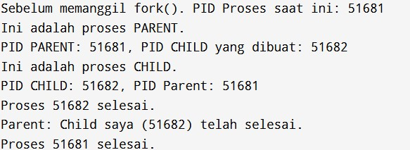

# Fork : Parent - Child Proces - Tugas Pertemuan 6 (25 Maret 2025)

Nama: Firda Rahayu

NRP: 3124521002

Kelas: 1 TI A 

# Soal 1

1. Buatlah tulisan tentang konsep fork dan implementasinya dengan menggunakan bahasa C !

## Tulisan tentang fork

Fungsi fork() adalah panggilan sistem fundamental dalam sistem operasi berbasis Unix-like (termasuk Linux) yang berfungsi untuk membuat proses baru, yang disebut proses *child, yang merupakan salinan identik dari proses pemanggilnya, yang disebut proses **parent. Ketika fork() dipanggil, kernel sistem operasi akan menciptakan ruang alamat memori baru untuk proses child yang sebagian besar identik dengan parent-nya (seringkali dengan teknik *copy-on-write untuk efisiensi). Kedua proses, parent dan child, akan melanjutkan eksekusi dari instruksi setelah panggilan fork(). Nilai kembalian dari fork() berfungsi sebagai penanda: proses child akan menerima nilai 0, sedangkan proses parent akan menerima Process ID (PID) dari proses child yang baru dibuat. Jika fork() gagal, ia akan mengembalikan -1 pada proses parent.

Implementasi fork() dalam C umumnya melibatkan pemeriksaan nilai kembalian untuk menentukan apakah kode dieksekusi oleh parent atau child, memungkinkan jalur eksekusi yang berbeda untuk setiap proses. Misalnya, proses child dapat diberikan tugas spesifik yang berbeda dari parent-nya, atau bahkan mengganti program yang sedang dijalankannya dengan program baru menggunakan keluarga fungsi exec(). Sementara itu, proses parent dapat memilih untuk menunggu child-nya selesai menggunakan wait() atau waitpid(), atau melanjutkan eksekusinya secara independen. Kemampuan ini menjadi tulang punggung bagi sistem operasi untuk mencapai concurrency dan menjalankan banyak program secara simultan, di mana sebuah proses utama dapat mendelegasikan bagian-bagian dari pekerjaannya kepada proses child.

## Input & Output 

#include <stdio.h>   // Untuk fungsi printf()
#include <unistd.h>  // Untuk fungsi fork(), getpid(), getppid()
#include <sys/wait.h> // Untuk fungsi wait()

int main() {
    pid_t pid; // Variabel untuk menyimpan Process ID

    printf("Sebelum memanggil fork(). PID Proses saat ini: %d\n", getpid());

    pid = fork(); // Memanggil fungsi fork()

    if (pid < 0) {
        // fork() gagal
        fprintf(stderr, "Fork Gagal!\n");
        return 1; // Mengembalikan kode error
    } else if (pid == 0) {
        // Ini adalah kode yang dieksekusi oleh proses CHILD
        printf("Ini adalah proses CHILD.\n");
        printf("PID CHILD: %d, PID Parent: %d\n", getpid(), getppid());
    } else {
        // Ini adalah kode yang dieksekusi oleh proses PARENT
        printf("Ini adalah proses PARENT.\n");
        printf("PID PARENT: %d, PID CHILD yang dibuat: %d\n", getpid(), pid);
        wait(NULL); // PARENT menunggu CHILD selesai
        printf("Parent: Child saya (%d) telah selesai.\n", pid);
    }

    printf("Proses %d selesai.\n", getpid()); // Dieksekusi oleh kedua proses

    return 0; // Mengembalikan kode sukses
}

# Soal 2

2. Deskripsikan dan visualisasikan pohon proses hasil eksekusi dari kode program fork 01.c -fork 06.c

## fork01.c

    - Deskripsi : 

        Kode fork01 tidak menggunakan fungsi fork(), jadi tidak ada proses baru yang akan dibuat. Program ini hanya akan menjalankan satu proses tunggal. Proses ini akan berulang kali menampilkan ID proses (PID), ID proses induk (PPID), dan ID pengguna (UID) pemiliknya sebanyak tiga kali. Setiap kali, ada jeda 3 detik. Karena tidak ada percabangan, semua nilai PID, PPID, dan UID yang ditampilkan akan sama di setiap iterasi.

    
    - Pohon proses :

        +------------------+
        |                  |
        |    Process A     |
        |   (PID: XXXX)    |
        |   (PPID: YYYY)   |
        |                  |
        +------------------+
                |
                |  (Tidak ada percabangan)
                |
                V
        +------------------+
        |                  |
        |   ...menjalankan |
        |      loop 3x...  |
        |                  |
        +------------------+
                |
                |
                V
             (Exit)

## fork02.c

    - Deskripsi : 

        menggunakan fork(), jadi akan ada dua proses. Proses induk adalah yang memulai program. Proses anak adalah salinan persis dari induk setelah fork(). Keduanya kemudian masuk ke loop tak terbatas. Setiap proses akan mencetak PID-nya sendiri dan nilai x. Penting untuk dicatat, x di setiap proses akan terpisah; perubahan pada satu tidak akan memengaruhi yang lain. Kedua proses akan menjeda 2 detik, lalu meningkatkan x mereka sendiri, dan terus berjalan sampai dihentikan manual.
    

    - Pohon proses :

        +------------------+
        |                  |
        |    Process A     |
        |   (Parent)       |
        |   (PID: XXXX)    |
        |   (PPID: YYYY)   |
        |   (x = 5 awal)   |
        +------------------+
                |
                |  fork()
                V
        +------------------+     +------------------+
        |                  |     |                  |
        |    Process A     |     |    Process B     |
        |   (Parent)       |     |     (Child)      |
        |   (PID: XXXX)    |     |    (PID: ZZZZ)   |
        |   (PPID: YYYY)   |     |    (PPID: XXXX)  |
        |   (x mulai dari 5) |     |    (x mulai dari 5) |
        +------------------+     +------------------+
                |                        |
                |                        |
                V                        V
         (Loop tak terbatas,       (Loop tak terbatas,
        x bertambah setiap 2s)   x bertambah setiap 2s)

        

## fork03.c

    - Deskripsi : 

        Kode C++ ini menggunakan fork() untuk membuat dua proses: satu proses induk dan satu proses anak. Setelah fork(), kedua proses akan menjalankan loop for sebanyak 5 kali. Di setiap iterasi, keduanya akan mencetak ID proses (PID) masing-masing dan kemudian berhenti selama 2 detik. Karena berjalan terpisah, output dari kedua proses akan muncul bergantian di konsol. Setelah 5 iterasi, kedua proses akan selesai.

Process A adalah proses induk, dan Process B adalah proses anak. Keduanya menjalankan loop yang sama secara terpisah

    - Pohon proses :

        +------------------+
        |                  |
        |    Process A     |
        |     (Parent)     |
        |   (PID: XXXX)    |
        |   (PPID:YYYY)    |
        +------------------+
                |
                |  fork()
                V
        +------------------+     +------------------+
        |                  |     |                  |
        |    Process A     |     |    Process B     |
        |     (Parent)     |     |     (Child)      |
        |   (PID: XXXX)    |     |    (PID: ZZZZ)   |
        |   (PPID:YYYY)    |     |    (PPID: XXXX)  |
        +------------------+     +------------------+
                |                        |
                |                        |
                V                        V
          (Loop 5x, mencetak PID,  (Loop 5x, mencetak PID,
          sleep 2s)               sleep 2s)
                |                        |
                |                        |
                V                        V
             (Exit)                   (Exit)

## fork04.c

    - Deskripsi : 

        Kode ini menggunakan fork() untuk membuat satu proses anak. Setelah fork(), ada dua jalur eksekusi: proses anak akan menampilkan PID-nya dan PID induknya lalu langsung berakhir. Sementara itu, proses induk akan menampilkan PID-nya dan PID anaknya, kemudian ia akan menunggu (wait()) hingga proses anaknya selesai sebelum induk sendiri berakhir.
    

    - Pohon proses :

        +------------------+
        |    Process A     |
        |     (Induk)      |
        |   (PID: XXXX)    |
        |   (PPID:YYYY)    |
        +------------------+
               |
               |  fork()
               V
        +------------------+     +------------------+
        |    Process A     |     |    Process B     |
        |     (Induk)      |     |     (Anak)       |
        |   (PID: XXXX)    |     |    (PID: ZZZZ)   |
        |   (PPID:YYYY)    |     |    (PPID: XXXX)  |
        +------------------+     +------------------+
                |                        |
                |                        |
                |           (Cetak info anak, lalu keluar)
                |                        |
                |                        V
                |                   (Anak selesai)
                |                        |
                |                  (SIGCHLD dikirim)
                |                        |
                V                        |
        (Cetak info induk)               |
        (Menunggu anak - wait())<--------+
                |
                V
        (Anak selesai, induk lanjut)
        (Cetak info induk, lalu keluar)
                |
                V
             (Selesai)

## fork05.c

    - Deskripsi : 

        Kode ini menggunakan fork() untuk membuat satu proses anak. Proses anak akan mencetak PID-nya, lalu segera menjalankan perintah /bin/ls -l /home menggunakan execl(), yang berarti ia akan berhenti menjalankan kode C++ ini dan menampilkan daftar file. Sementara itu, proses induk akan mencetak PID-nya dan PID anaknya, kemudian akan menunggu (wait()) sampai proses anak (yang sekarang adalah ls) selesai, sebelum induk sendiri mengakhiri program.
    

    - Pohon proses :

        +------------------+
        |    Process A     |
        |     (Induk)      |
        |   (PID: XXXX)    |
        |   (PPID:YYYY)    |
        +------------------+
                |
                |  fork()
                V
        +------------------+     +------------------+
        |    Process A     |     |    Process B     |
        |     (Induk)      |     |     (Anak)       |
        |   (PID: XXXX)    |     |    (PID: ZZZZ)   |
        |   (PPID:YYYY)    |     |    (PPID: XXXX)  |
        +------------------+     +------------------+
                |                        |
                |                        |
                |           (Cetak info anak)
                |                        |
                |           (execl() -> Menjadi /bin/ls -l /home)
                |                        |
                |                        V
                |                   (Anak Selesai/Keluar dari ls)
                |                        |
                |                  (Induk Menerima Sinyal)
                |                        |
                V                        |
        (Cetak info induk)               |
        (Menunggu Anak - wait())<--------+
                |
                V
        (Induk Selesai)   

## fork06.c

    - Deskripsi : 

        Kode ini menggunakan fork() untuk membuat satu proses anak. Proses anak akan menampilkan PID-nya, lalu mencoba menjalankan program bernama "fork03" menggunakan execl(). Jika "fork03" berhasil dijalankan, kode asli di proses anak akan berhenti, dan anak akan menjalankan "fork03" sepenuhnya. Sementara itu, proses induk akan menampilkan PID-nya dan PID anaknya, kemudian menunggu (wait()) hingga proses anak (baik yang menjalankan "fork03" atau yang keluar jika execl() gagal) selesai, sebelum induk sendiri mengakhiri program.
    

    - Pohon proses :

        +------------------+
        |    Process A     |
        |     (Induk)      |
        |   (PID: XXXX)    |
        |   (PPID:YYYY)    |
        +------------------+
                |
                |  fork()
                V
        +------------------+     +------------------+
        |    Process A     |     |    Process B     |
        |     (Induk)      |     |     (Anak)       |
        |   (PID: XXXX)    |     |    (PID: ZZZZ)   |
        |   (PPID:YYYY)    |     |    (PPID: XXXX)  |
        +------------------+     +------------------+
                |                        |
                |                        |
                |           (Cetak info anak)
                |                        |
                |           (execl() -> Menjadi /bin/ls)
                |                        |
                |                        V
                |                   (Anak Selesai/Keluar dari ls)
                |                        |
                |                  (Induk Menerima Sinyal)
                |                        |
                V                        |
        (Cetak info induk)               |
        (Menunggu Anak - wait())<--------+
                |
                V
        (Induk Selesai)

