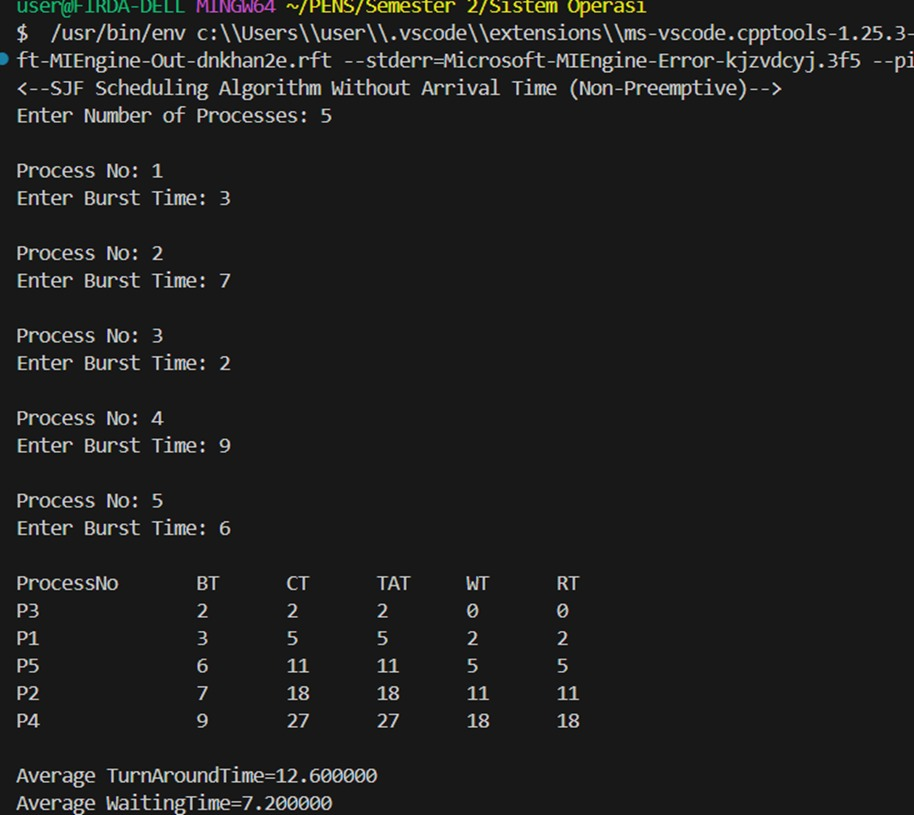
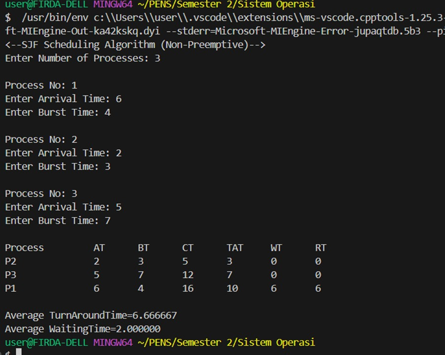
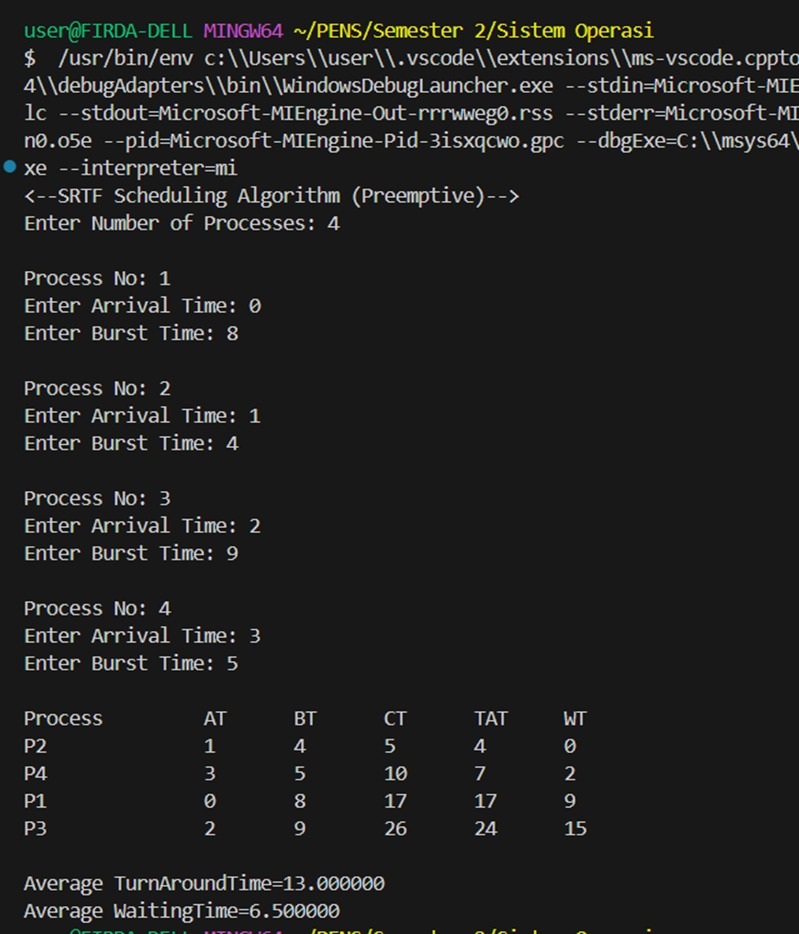

# Scheduling Algorithms

NAMA : Firda Rahayu

NRP : 3124521002

KELAS : IT A

## 1.SJF without arrival time (non-preemptive)

### Output :

analisa : Program C ini mensimulasikan algoritma penjadwalan Shortest Job First (SJF) secara non-preemptive, dengan asumsi semua proses tiba pada waktu nol. Program dimulai dengan mendefinisikan struktur proc untuk menyimpan detail proses seperti nomor, waktu burst (bt), waktu selesai (ct), waktu penyelesaian (tat), dan waktu tunggu (wt). Fungsi read bertanggung jawab untuk mengambil input waktu burst untuk setiap proses secara interaktif. Dalam fungsi main, setelah mendapatkan jumlah total proses, program membaca waktu burst untuk setiap proses. Selanjutnya, program mengimplementasikan algoritma bubble sort untuk mengatur proses dalam urutan menaik berdasarkan waktu burst mereka. Setelah pengurutan ini, program mengulang melalui proses yang telah diurutkan untuk menghitung waktu selesai, waktu penyelesaian (yang sama dengan waktu selesai karena waktu kedatangan adalah 0), dan waktu tunggu mereka. Terakhir, program mencetak tabel yang merangkum metrik ini untuk setiap proses dan menghitung serta menampilkan rata-rata waktu penyelesaian dan rata-rata waktu tunggu untuk semua proses.

## 2.SJF with arrival time (non-prremptive)

### output :

analisa :  Program C ini mensimulasikan algoritma penjadwalan Shortest Job First (SJF) non-preemptive, secara eksplisit menggabungkan waktu kedatangan proses untuk menentukan urutan eksekusi. Program dimulai dengan mendefinisikan struktur proc untuk menyimpan detail setiap proses, termasuk nomor, waktu kedatangan (at), waktu burst (bt), waktu mulai awal (it), waktu selesai (ct), waktu penyelesaian (tat), dan waktu tunggu (wt). Setelah mengumpulkan jumlah proses serta waktu kedatangan dan waktu burst masing-masing dari pengguna, program awalnya mengurutkan semua proses berdasarkan waktu kedatangan mereka. Selanjutnya, program memastikan bahwa di antara proses yang tiba secara bersamaan pada waktu paling awal, proses dengan waktu burst terpendek dijadwalkan terlebih dahulu. Lingkaran penjadwalan utama kemudian secara iteratif memilih pekerjaan terpendek dari kumpulan proses yang telah tiba pada waktu penyelesaian proses yang dieksekusi sebelumnya. Untuk setiap proses yang dipilih, waktu eksekusi awalnya dihitung, memperhitungkan potensi waktu idle CPU jika proses tiba setelah yang sebelumnya selesai. Setelah ini, program menghitung waktu selesai, waktu penyelesaian (waktu selesai dikurangi waktu kedatangan), dan waktu tunggu (waktu penyelesaian dikurangi waktu burst) untuk setiap proses. Terakhir, program menyajikan tabel komprehensif yang merangkum metrik ini untuk semua proses dan menghitung rata-rata waktu penyelesaian keseluruhan dan rata-rata waktu tunggu, memberikan simulasi lengkap algoritma SJF non-preemptive dengan waktu kedatangan dinamis.

## 3.SRTF (preemptive) contoh kasus sesuaikan dengan PPT

### Output :

analisa : Program C ini dengan cermat mensimulasikan algoritma penjadwalan Shortest Remaining Time First (SRTF), yang merupakan varian preemptive dari Shortest Job First, dengan secara eksplisit menggabungkan waktu kedatangan proses. Program mendefinisikan struktur proc untuk menyimpan nomor proses, waktu kedatangan, total waktu burst, sisa waktu burst, waktu selesai, waktu penyelesaian, dan waktu tunggu, menginisialisasi sisa waktu dengan waktu burst. Setelah mengumpulkan jumlah proses serta waktu kedatangan dan waktu burst masing-masing dari pengguna, proses awalnya diurutkan berdasarkan waktu kedatangan mereka. Inti dari logika SRTF diimplementasikan dalam loop berbasis waktu yang mensimulasikan eksekusi CPU. Di setiap unit waktu, program secara dinamis mengidentifikasi proses yang telah tiba dan saat ini memiliki sisa waktu burst terpendek di antara semua proses yang tersedia. Proses yang dipilih ini kemudian diizinkan untuk dieksekusi selama satu unit waktu, mengurangi sisa waktu burst-nya. Mekanisme evaluasi ulang dan pemilihan yang berkelanjutan ini secara inheren mengimplementasikan preemption, memungkinkan CPU untuk beralih ke proses yang baru tiba atau yang tersedia saat ini jika sisa waktunya lebih pendek daripada yang sedang berjalan. Ketika sebuah proses selesai dieksekusi (sisa waktunya menjadi nol), waktu penyelesaiannya dicatat, dan waktu penyelesaian serta waktu tunggunya dihitung dan diakumulasikan untuk rata-rata keseluruhan. Terakhir, program menampilkan tabel terperinci yang menunjukkan metrik ini untuk setiap proses dan menyajikan rata-rata waktu penyelesaian dan rata-rata waktu tunggu yang dihitung untuk seluruh kumpulan proses.

