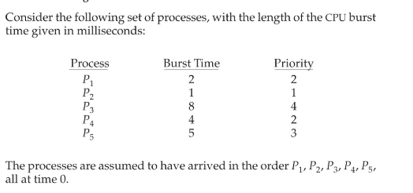
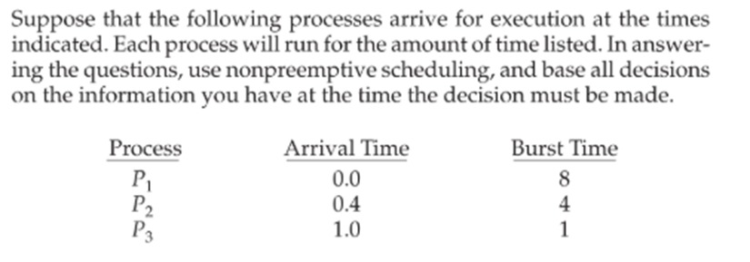
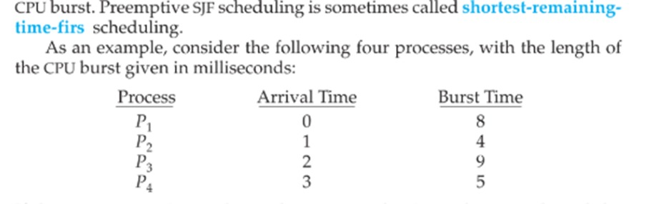

# Scheduling Algorithms 2 - Tugas Pertemuan 14 (27 Mei 2025)

NAMA : Firda Rahayu

NRP : 3124521002

KELAS : IT A

## 1.SJF without arrival time (non-preemptive)

Contoh Kasus:

Analisa : Berdasarkan contoh kasus tersebut, semua proses (P1, P2, P3, P4, P5) tersedia di t=0. Scheduler akan memindai daftar ini untuk menemukan proses dengan prioritas tertinggi. Urutan prioritas dari tertinggi ke terendah adalah: P2 (Prioritas 1), P1 (Prioritas 2), P4 (Prioritas 2), P5 (Prioritas 3), P3 (Prioritas 4).

Jika ada dua proses dengan prioritas yang sama (seperti P1 dan P4 yang sama-sama Prioritas 2), aturan umum adalah menggunakan FCFS (First-Come, First-Served) sebagai tie-breaker. Namun, karena tidak ada arrival time yang eksplisit selain t=0, urutan masukan atau nomor proses dapat menjadi tie-breaker (misalnya, P1 sebelum P4). Untuk analisis ini, saya akan asumsikan P1 akan dipilih sebelum P4 jika prioritasnya sama karena P1 muncul duluan dalam daftar.

Urutan Eksekusi:

1. P2 (Prioritas 1, BT=1): Ini adalah proses dengan prioritas tertinggi. P2 akan dieksekusi pertama dari t=0 hingga t=1.
2. Setelah P2 selesai, CPU bebas di t=1. Dari proses yang tersisa, P1 dan P4 memiliki Prioritas 2. Berdasarkan aturan tie-breaking, P1 (Prioritas 2, BT=2) akan dipilih. P1 akan dieksekusi dari t=1 hingga t=1 + 2 = t=3.
3. Setelah P1 selesai, CPU bebas di t=3. P4 (Prioritas 2, BT=4) adalah proses prioritas tertinggi berikutnya. P4 akan dieksekusi dari t=3 hingga t=3 + 4 = t=7.
4. Setelah P4 selesai, CPU bebas di t=7. P5 (Prioritas 3, BT=5) adalah proses prioritas tertinggi berikutnya. P5 akan dieksekusi dari t=7 hingga t=7 + 5 = t=12.
5. Terakhir, setelah P5 selesai, CPU bebas di t=12. P3 (Prioritas 4, BT=8) adalah proses tersisa dengan prioritas terendah. P3 akan dieksekusi dari t=12 hingga t=12 + 8 = t=20.

## 2.SJF with arrival time (non-prremptive)

Contoh Kasus: 

Analisa :  Pada contoh kasus yang diberikan (P1: AT=0.0, BT=8.0; P2: AT=0.4, BT=4.0; P3: AT=1.0, BT=1.0), dinamika SJF non-preemptive terlihat jelas. Pada time=0.0, hanya P1 yang tersedia. Meskipun P1 memiliki burst time yang relatif panjang (8.0), ia adalah satu-satunya pilihan, sehingga P1 segera mulai dieksekusi dan akan berjalan penuh hingga time=8.0 karena sifat non-preemptive. Selama P1 berjalan, P2 (tiba di time=0.4) dan P3 (tiba di time=1.0) masuk ke ready queue. Setelah P1 selesai pada time=8.0, CPU menjadi bebas. 

Pada titik ini, scheduler SJF akan mengevaluasi P2 dan P3 yang keduanya sudah tersedia. Karena P3 memiliki burst time yang jauh lebih pendek (1.0) dibandingkan P2 (4.0), P3 akan dipilih untuk dieksekusi. P3 kemudian berjalan dari time=8.0 hingga time=9.0. Setelah P3 selesai, P2 menjadi satu-satunya proses yang tersisa di ready queue dan akan dieksekusi dari time=9.0 hingga time=13.0.Urutan eksekusi akhir adalah P1, diikuti oleh P3, dan terakhir P2. Dari sini, dapat dihitung bahwa P1 tidak memiliki waktu tunggu, P3 menunggu P1 selesai, dan P2 menunggu P1 dan P3 selesai. 

## 3.SRTF (preemptive) 

Contoh Kasus:

Analisa : Pada awalnya, di waktu t=0, hanya P1 yang tersedia, sehingga ia mulai dieksekusi. Namun, dinamika SRTF segera terlihat ketika pada waktu t=1, P2 tiba. Sisa waktu P1 yang saat itu 7 unit (8-1) akan dibandingkan dengan burst time P2 yaitu 4 unit. Karena P2 lebih pendek, P1 segera di-preempt, dan P2 mengambil alih CPU. Proses ini berlanjut; pada waktu t=2 dan t=3, meskipun P3 dan P4 tiba, sisa waktu P2 (yang terus berkurang menjadi 2 dan 1) masih lebih pendek dibandingkan burst time awal P3 (9) dan P4 (5), sehingga P2 terus berjalan.

P2 selesai dieksekusi pada waktu t=5. Pada titik ini, P1, P3, dan P4 semuanya sudah tiba dan berada di antrean siap. Scheduler kemudian mengevaluasi sisa waktu mereka: P1 (sisa 7), P3 (sisa 9), dan P4 (sisa 5). SRTF akan memilih P4 karena memiliki sisa waktu terpendek. P4 kemudian dieksekusi secara berurutan hingga selesai pada waktu t=10.

Setelah P4 selesai, proses yang tersisa adalah P1 (sisa 7) dan P3 (sisa 9). Kembali, SRTF memilih yang terpendek, yaitu P1. P1 melanjutkan eksekusinya dari sisa waktunya dan selesai pada waktu t=18. Terakhir, hanya P3 yang tersisa di antrean. P3 kemudian dieksekusi tanpa gangguan hingga selesai pada waktu t=27.